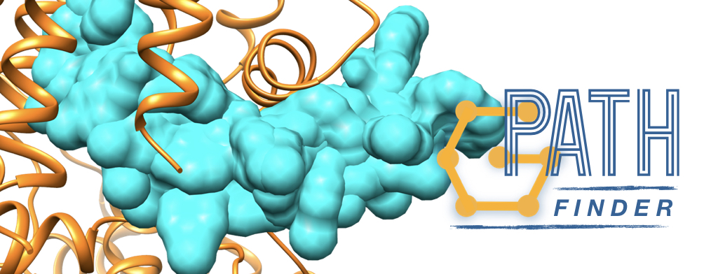

.. GPathFinder: Identification of ligand binding pathways
.. by a multi-objective genetic algorithm

   https://github.com/insilichem/gpathfinder

   Copyright 2019 José-Emilio Sánchez Aparicio, Giuseppe Sciortino,
   Daniel Villadrich Herrmannsdoerfer, Pablo Orenes Chueca,
   Jaime Rodríguez-Guerra Pedregal and Jean-Didier Maréchal

   Licensed under the Apache License, Version 2.0 (the "License");
   you may not use this file except in compliance with the License.
   You may obtain a copy of the License at

        http://www.apache.org/licenses/LICENSE-2.0

   Unless required by applicable law or agreed to in writing, software
   distributed under the License is distributed on an "AS IS" BASIS,
   WITHOUT WARRANTIES OR CONDITIONS OF ANY KIND, either express or implied.
   See the License for the specific language governing permissions and
   limitations under the License.

GPathFinder
===========

.. image:: https://readthedocs.org/projects/gpathfinder/badge/?version=latest
    :target: https://gpathfinder.readthedocs.io/en/latest/

.. image:: https://anaconda.org/josan_bcn/gpathfinder/badges/installer/conda.svg
    :target: https://anaconda.org/josan_bcn/gpathfinder

.. image:: https://img.shields.io/badge/python-2.7.16-blue.svg
   :target: https://www.python.org/downloads/release/python-2716

.. image:: https://img.shields.io/github/license/insilichem/gpathfinder.svg?color=orange
   :target: http://www.apache.org/licenses/LICENSE-2.0

.. image:: https://img.shields.io/badge/doi-10.3390%2Fijms20133155-blue.svg
   :target: https://www.mdpi.com/1422-0067/20/13/3155

.. image:: https://img.shields.io/static/v1.svg?label=platform&message=linux%20|%20macOS&color=lightgrey

GPathFinder is an extension built over GaudiMM core to allow the identification
of ligand binding pathways at atomistic level.

Features
--------

**Different options for generate pathways**

- Unbinding routes from a known binding site
- Binding routes to a known binding site
- Channel analysis (given starting and final points)

**Flexibility for the ligand**

- Dihedral angles
- Pool of conformations provided by the user (e.g. through conformer generation)

**Different levels of flexibility for the receptor**

- Side-chain flexibility using rotamer libraries
- Global movements by Normal Mode Analysis sampling
- Global movements extracted from a PCA analysis over a MD trajectory (.dcd file)
- Pool of conformations provided by the user (e.g. snapshots from a MD trajectory)

**Different options for evalute and optimize the solutions**

- Steric clashes
- Vina scoring function
- Smina, with the possibility to customize the scoring function and use custom atom parameters
- Smoothness of the ligand movements

Documentation and support
-------------------------

Documentation source is available in ``docs/`` subdirectory, and also compiled as HTML at `this webpage <https://gpathfinder.readthedocs.io/en/latest/>`_.

If you need help with GPathFinder, please use the `issues page <https://github.com/insilichem/gpathfinder/issues>`_ of our `GitHub repo <https://github.com/insilichem/gpathfinder>`_. You can drop me a message at `joseemilio.sanchez@uab.cat <mailto:joseemilio.sanchez@uab.cat>`_ too.

**Developer friendly**

If the provided genes and objectives are not enough, you can always code your own ones. Check out the `developer docs <https://gpathfinder.readthedocs.io/en/latest/developers.html>`_!

License
-------

GPathFinder and GaudiMM are licensed under the Apache License, Version 2.0. Check the details in the `LICENSE <https://raw.githubusercontent.com/insilichem/gpathfinder/master/LICENSE>`_ file.

History of versions
-------------------

- **v1.3.0:** 10th November 2020
The user can provide a set of conformations for the ligand or the protein or both. This allows, for example, to use a set of snapshots from a MD trajectory to define the conformational space that GPathFinder will explore.

You have a tutorial on `how to use <https://gpathfinder.readthedocs.io/en/latest/tutorial-conformers.html>`_ the new feature.

- **v1.2.1:** 18th March 2020
Bug fix: problems with the format of some .mol2 files, that produced an error like "ValueError: invalid literal for int() with base 10:" when saving the results of GPathFinder. Thanks to Manish K. from the Nagoya University for reporting it.

- **v1.2.0:** 30th October 2019
New ``PCA analysis`` functionality. If you have a trajectory file of a molecular dynamics, you can now include low energy motions calculated throughout PCA analysis. GPathFinder would include those movements in its calculations.

- **v1.1.0:** 6th September 2019
New ``smina`` scoring. Possibility of using its built-in scoring functions or making a custom file with your own one. Also allows to introduce your custom atom parameters file.

- **v1.0.1:** 25th July 2019
New ``summary.csv`` file in the output with score data of all the solutions.

New format for the ``.pdb`` files of the output that can be imported as a MD movie in UCSF Chimera.

New ``trajectory.pdb`` file in the output. For each solution, shows the trajectory of the ligand, taking its center as a reference.

Command to lauch the program is now ``gpath run`` instead of ``gaudi run`` to ensure compatibility with GaudiMM.

Bug fix: similarity between solutions is calculated now at each generation, to avoid some cases where repeated or very similar solutions appeared, especially when using only clashes evaluation.

- **v1.0.0:** Release version. Used in the benchmark and cases study of the article.

OS Compatibility
----------------

GPathFinder is compatible with Linux and macOS.

If you find some dificulties when installing it in a concrete distribution, please use the `issues page <https://github.com/insilichem/gpathfinder/issues>`_ to report them.

How to cite this software
-------------------------

To cite this software, please refer to our `article in IJMS <https://www.mdpi.com/1422-0067/20/13/3155>`_:

Sánchez-Aparicio, J.-E.; Sciortino, G.; Herrmannsdoerfer, D.V.; Chueca, P.O.; Pedregal, J. .-G.; Maréchal, J.-D. GPathFinder: Identification of Ligand-Binding Pathways by a Multi-Objective Genetic Algorithm. *Int. J. Mol. Sci.* **2019**, *20*, 3155.

