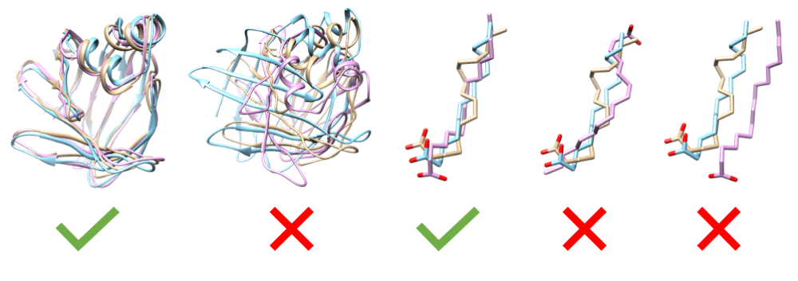
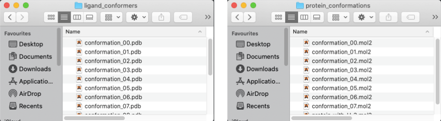
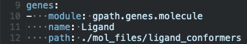
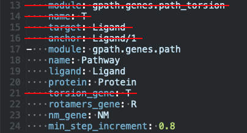
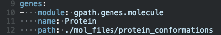
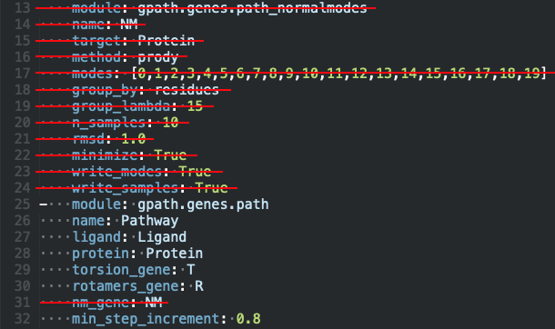
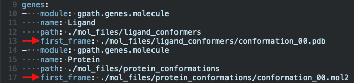

.. GPathFinder: Identification of ligand binding pathways
.. by a multi-objective genetic algorithm

   https://github.com/insilichem/gpathfinder

   Copyright 2019 José-Emilio Sánchez Aparicio, Giuseppe Sciortino,
   Daniel Villadrich Herrmannsdoerfer, Pablo Orenes Chueca,
   Jaime Rodríguez-Guerra Pedregal and Jean-Didier Maréchal

   Licensed under the Apache License, Version 2.0 (the "License");
   you may not use this file except in compliance with the License.
   You may obtain a copy of the License at

        http://www.apache.org/licenses/LICENSE-2.0

   Unless required by applicable law or agreed to in writing, software
   distributed under the License is distributed on an "AS IS" BASIS,
   WITHOUT WARRANTIES OR CONDITIONS OF ANY KIND, either express or implied.
   See the License for the specific language governing permissions and
   limitations under the License.

.. _tutorial-conformers:

=========================================================================
How to use your custom pool of conformations in a GPathFinder calculation
=========================================================================

Objectives
==========

Since version 1.3.0 GPathFinder allows to provide a custom set of conformations for the ligand or the protein or both. It allows restraining the conformational space that the calculation will explore.

This feature would be of particular utility when the conformational space of a molecule is known beforehand. For example, suppose you have a sampling for your protein obtained from a Molecular Dynamics. In that case, it could be interesting to see if the ligand can access the binding site using only that set of conformations of the protein. The same applies for the ligand, you can have a bunch of conformers that are known to be the most stable, and therefore it could be interesting to test if it can access the binding site adopting only those conformations.

This tutorial aims at providing the information on how to configure a GPathFinder calculation to take profit of this feature. It is mainly divided into two sections: first, how to correctly generate the set of files for the conformations; and second, how to parametrize the `.yaml` file.

1. Preparing files for the pool of conformations
================================================

You need a `.mol2` file or a `.pdb` file for each conformation of your molecule/s, regardless of whether they are ligand or receptor. You can use either the `.mol2` or `.pdb` formats, but mixing different types of files for a molecule could produce strange results.

.. warning::

   It is **essential** that all the files for a molecule share the same atomic structure and atom order. They are a pool of conformations, not a pool of different chemical structures. In particular, it is useful to check the files when they provide from various sources, for example, snapshots from an MD and a crystallographic structure from the PDB. For the protein files, it is also important that all files share the same residue numbering and order.

The conformations should be appropriately aligned. In the case of the protein, you can choose as the alignment reference either the whole structure or only the region of interest. Between ligand conformations, the centre of mass and orientation should be as similar as possible.

.. tip::

   In `UCSF Chimera`, you can achieve a proper alignment of proteic molecules using the `MatchMaker command <https://www.cgl.ucsf.edu/chimera/docs/ContributedSoftware/matchmaker/matchmaker.html>`_. To align small molecules (i.e. ligand) you can use the `match command <https://www.cgl.ucsf.edu/chimera/docs/UsersGuide/midas/match.html>`_.

Once you have generated the files of the conformations, you should group them in a folder containing all the files of the molecule. For example, suppose you are generating conformations for both the ligand and the receptor. In that case, you must end up with two folders, one containing **only** the files for the ligand and the other **only** the files for the receptor:

2. Preparing the GPathFinder .yaml input file
=============================================

- If you are using several files for the ligand molecule:

1. You should indicate in the Ligand `molecule` gene the route to the folder containing the ligand conformations:

2. It is not allowed to use a `path_torsion` gene together with a custom pool of conformations for the ligand. Then, you should delete both the `path_torsion` gene and its reference in the `path` gene:

- If you are using several files for the protein molecule:

1. You should indicate in the Protein `molecule` gene the route to the folder containing the receptor conformations:

2. It is not allowed to use a `path_normalmodes` gene together with a custom pool of conformations for the protein. Then, you should delete both the `path_normalmodes` gene and its reference in the `path` gene:

.. tip::

   As said, you can use a custom pool of conformations for one of the molecules (ligand or protein), or both. You would need to modify one or both `molecule` gene/s and the `path` gene accordingly.

3. Indicating the initial conformation of the pathway
=====================================================

Sometimes, for example, when you are calculating an unbinding pathway from an already known position, you may want to fix the initial conformation of the ligand/protein. This can be done by indicating the file-path of the initial conformation in the  parameter `first_frame` of the corresponding `molecule` gene:

