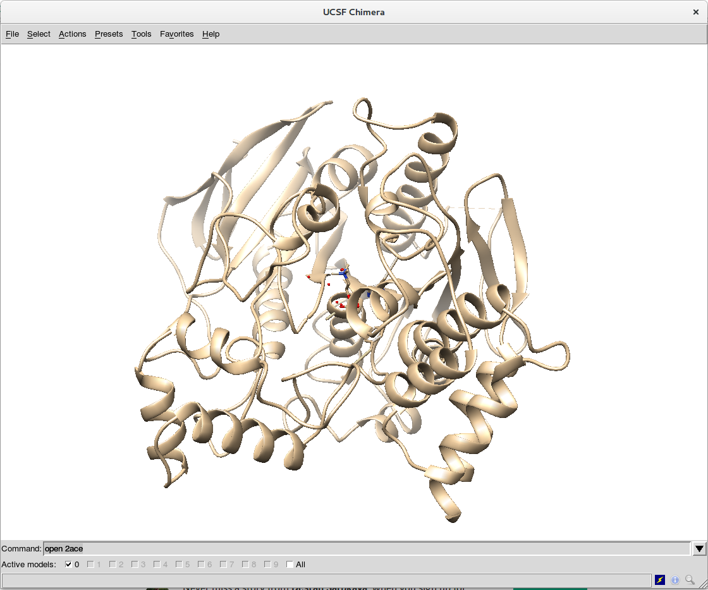
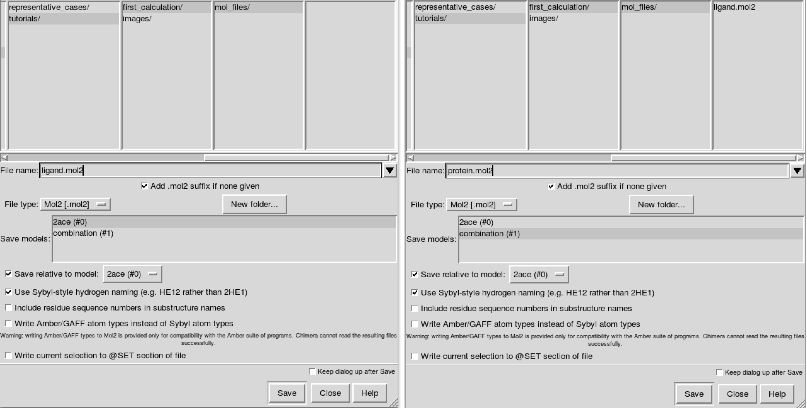
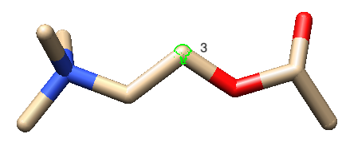
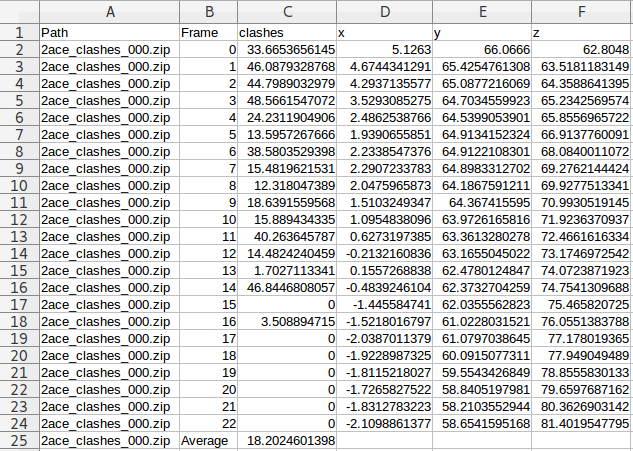

.. GPathFinder: Identification of ligand binding pathways 
.. by a multi-objective genetic algorithm

   https://github.com/insilichem/gpathfinder

   Copyright 2019 José-Emilio Sánchez Aparicio, Giuseppe Sciortino,
   Daniel Villadrich Herrmannsdoerfer, Pablo Orenes Chueca, 
   Jaime Rodríguez-Guerra Pedregal and Jean-Didier Maréchal
   
   Licensed under the Apache License, Version 2.0 (the "License");
   you may not use this file except in compliance with the License.
   You may obtain a copy of the License at

        http://www.apache.org/licenses/LICENSE-2.0

   Unless required by applicable law or agreed to in writing, software
   distributed under the License is distributed on an "AS IS" BASIS,
   WITHOUT WARRANTIES OR CONDITIONS OF ANY KIND, either express or implied.
   See the License for the specific language governing permissions and
   limitations under the License.

.. _tutorial-first:

==================================
Your first GPathFinder calculation
==================================

Objectives
==========

This tutorial aims at providing an overview of a typical workflow when carrying out a GPathFinder calculation. It is divided in four sections. As all the input/output files for each section are available `here <https://raw.githubusercontent.com/insilichem/gpathfinder/master/docs/data/tutorial_first/first_calculation.zip>`_, you can follow the entire tutorial sequentially or you can choose one of the sections individually.

We propose the example of Acetylcholine bound to Acetylcholinesterase to study the possible unbinding routes of the ligand. The structure that is going to be used corresponds to the PDB code **2ace**.

1. Preparing ligand and receptor `.mol2` files
==============================================

- **Necessary files for this section**: None
- **Output files from this section**: ligand.mol2, ligand_with_H.mol2, protein.mol2, protein_with_H.mol2

The first step is to obtain the complete structure of the system. It can be done by several manners, but we propose the following two options:

- Download the `.pdb` file from the `Protein Data Bank <https://www.rcsb.org/structure/2ace>`_. Option ``Download Files -> PDB Format``. Open the downloaded file (`2ace.pdb`) with UCSF Chimera (you can use other visualization tool, of course).
- Directly use UCSF Chimera and open the structure in the viewer with the command ``open 2ace``. You can open the command terminal of Chimera with ``Favorites -> Command Line``.

Regardless of the option you choose, you will end up with the structure of `2ace` in the viewer:

The next step is to clean up the system:

- Remove non essential small molecules. In this case, we remove all water molecules by the following Chimera command: ``del :HOH``
- Remove alternative locations for residues (i.e. rotamers), if existing. In this case there are not such alternative locations, but it would be removed by the Chimera commands: ``del @/altLoc=B``, ``del @/altLoc=C``, ...

Then, you have to split the system into two different models. In Chimera, it can be done by the following steps:

- In the model panel (``Favorites -> Model Panel``), ``copy/combine`` the whole system to have two identical replicas.
- Remove the receptor from the first model with command ``del #0 & protein``
- Remove the ligand from the second model with command ``del #1 & ligand``

Save the `ligand.mol2` and `protein.mol2` files with ``File -> Save Mol2``. You have to select model (#0) when saving the **ligand** and model (#1) for the **protein**. Make sure that `Save relative to model: (#0)` is marked to preserve coherent relative coordinates in both files. Save the files in a folder called `mol_files` inside a `first_calculation` folder:

If you want to optimize the solutions using only clashes, that would be enough. But if you want to add a Vina scoring criterium, files with explicit hydrogens are needed. To do so, you can add hydrogens in Chimera with ``Tools -> Structure Editing -> AddH``. Once you have both models (ligand and protein) with hydrogens, you can save them as before using different names, for example `ligand_with_H.mol2` and `protein_with_H.mol2`.

2. Preparing `input.yaml` file
==============================

- **Necessary files for this section**: ligand.mol2/ligand_with_H.mol2, protein.mol2/protein_with_H.mol2
- **Output files from this section**: input_clashes.yaml/input_clashes_vina.yaml

To prepare the configuration `.yaml` file, you have several templates available at :ref:`input`. Here, we are going to use either `discover unbinding pathways with clashes evaluation <https://raw.githubusercontent.com/insilichem/gpathfinder/master/examples/input_files/unbinding_clashes.yaml>`_ or `discover unbinding pathways with clashes+vina evaluation <https://raw.githubusercontent.com/insilichem/gpathfinder/master/examples/input_files/unbinding_clashes_vina.yaml>`_ as base for our input configuration file.

.. warning:: 

   Remember: if you are going to evaluate clashes+vina, the `.mol2` files prepared in `step 1` have to include explicit hydrogen atoms. For only clashes, without hydrogens would be enough.
   
You have to make the following changes/adjustements in your template file:

- ``_path: input.yaml`` (or the name you choose for your configuration file)

**ga section**

- ``generations: XXX`` (the values provided in the templates ensure good results for a general case, but you can adjust it to reduce the computation time)

**genes section**

- ``path: ./mol_files/ligand.mol2`` (path of your ligand `.mol2` file)
- ``path: ./mol_files/protein.mol2`` (path of your protein `.mol2` file)
- ``anchor: Ligand/3`` 

.. tip:: 

   To ensure that torsions of the dihedral angles in the ligand molecule are modified in a proper manner, we recommend to choose an **anchor atom** near the geometric center of the ligand. You have to indicate the name of the ligand gene and the Chimera serial number of the atom, in this case ``Ligand/3``. To know the serial number, you can open in text mode the `.mol2` file, or, visualize the property inside Chimera: select the atom and, then, show its serial number with ``Actions -> Label -> Other -> Label with attribute: serialNumber``.

**output section**

- ``name: 2ace`` (choose a name for your calculation)
- ``path: ./results_2ace`` (folder where the results of the calculation will be saved)

Finally, you have to save your `.yaml` inside your calculation folder, for example `first_calculation`.

3. Running the calculation
==========================

- **Necessary files for this section**: ligand.mol2/ligand_with_H.mol2, receptor.mol2/receptor_with_H.mol2, input_clashes.yaml/input_clashes_vina.yaml
- **Output files from this section**: folder with GPathFinder results

Running your calculation is as easy as open a **terminal**, activate your **conda environment** with:

::

  conda activate name_of_the_environment

or

::

  source activate name_of_the_environment
  
Go to your calculation folder, where `input_clashes.yaml` or `input_clashes_vina.yaml` is located, and run it with:

::

   gpath run input_clashes.yaml

or

::

   gpath run input_clashes_vina.yaml

4. Visualizing results
======================

- **Necessary files for this section**: folder with GPathFinder results
- **Output files from this section**: None

Inside the `results` folder you can find, among other files, a `summary.csv` file with an overview of the solutions that GPathFinder has obtained from your calculation. As any standard `.csv` file, you can open it with `LibreOffice Calc`, `Microsoft Excel` or any other editor you want.

For each solution, you will find the scoring (clashes, vina, etc.) and the coordinates of the ligand at every frame forming the (un)binding pathway. Moreover, the last line of every solution will be the average score for all the frames of the pathway. For example, the solution called "2ace_clashes_000" has 23 frames with a clashes average of 18.2 Å\ :sup:`3`:

The corresponding `.zip` file (in this case, `2ace_clashes_000.zip`) contains the actual information about the solution. For a complete description of all the files, you can refer to the section :ref:`output`. Here we are centering on visualize the structures that form the (un)binding pathway. To do so, you have two possibilities:

- Open the ``2ace_clashes_000.zip -> Pathway_000_Pathway.zip -> frame_XXX.pdb`` files directly with your favourite visualization tool (e.g. UCSF Chimera). They contain the structure of the receptor + ligand complex at every position (frame) of the (un)binding process, so you can choose the frames that you want and examine them individually.
- Use the ``Tools -> MD/Ensemble Analysis -> MD Movie`` in UCSF Chimera (select the `PDB frames contained in multiple files` option). It will open the frames that you select as a movie, so you can analyze the (un)binding process:

.. image:: data/tutorial_first/tutorial_first_img5.gif
	:align: center
	:alt: Unbinding_movie

Whatever option you choose, you will end with the desired structure/s in your visualization tool, so you can use it for further analysis. If you want to deepen the analysis of GPathFinder solutions, you can follow the tutorial :ref:`tutorial-output`.
